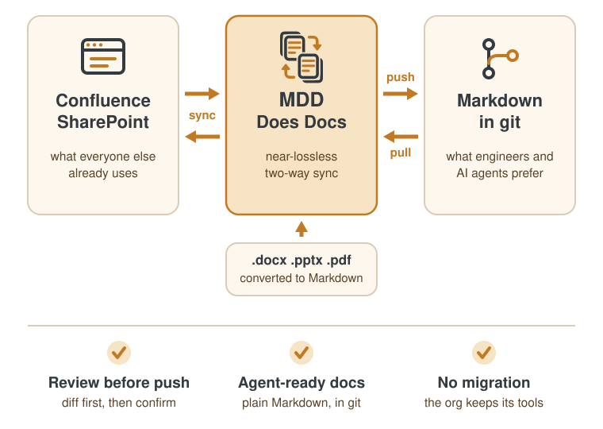

# MDD Does Docs

Bidirectional sync between Markdown-in-git and Confluence/SharePoint.

`mdd` does near-lossless roundtrips between a git repository of Markdown and
remote document management systems. Engineers and AI agents can work with
Markdown while everyone else can continue working with the tools they know.

<picture>
  <source media="(prefers-color-scheme: dark)" srcset="assets/mdd-infographic-dark.svg">
  
</picture>

📖 **Documentation: <https://schubergphilis.github.io/mdd/>**

## ⚠️ Beta software - use with care

`mdd` is written almost entirely by AI agents under human review. There
is no independent security review and no stable 1.0 release yet. Consider:

- Push operations (like `mdd confluence sync-space`) can clobber production
  systems.
- There is some data protection support
  (spec [`S07`](docs/spec/S07-data-protection.md)), but this has not been
  independently reviewed.
- The `mdd ai` commands make AI API calls, and AI can make mistakes.

## Install

With [`uv`](https://docs.astral.sh/uv/):

```bash
uv tool install git+https://github.com/schubergphilis/mdd
mdd --version
```

## Selected commands

Run `mdd help` to discover more.

### Confluence

| Command | Description |
|---|---|
| `mdd confluence sync-space <space-key>` | Sync a Confluence space with its git mirror |
| `mdd confluence export-page <id-or-url>` | Export a single page to `.md` |
| `mdd confluence create-page <file.md>` | Create a new Confluence page from a local Markdown file |
| `mdd confluence update-page <file.md>` | Push local edits back to Confluence (diff + confirm) |

### Document conversion

| Command | Description |
|---|---|
| `mdd convert <path>` | Convert `.docx`/`.pptx`/`.pdf` to Markdown |
| `mdd new <dir>` | Create a Quarto project with PPTX + DOCX output |
| `mdd pdf [dir]` | Export Office files to PDF |

### SharePoint

| Command | Description |
|---|---|
| `mdd sharepoint sync-site <name>` | Sync a SharePoint site with its git mirror |
| `mdd sharepoint list-sites` | List OneDrive-synced SharePoint sites |
| `mdd sharepoint sync-folder <path>` | Sync a local OneDrive folder with its git mirror |

### Search and AI

| Command | Description |
|---|---|
| `mdd search "<query>"` | Search across configured mirror roots |
| `mdd ai rewrite <file>` | Rewrite Markdown for clarity and tone |
| `mdd ai index <dir>` | Walk a directory and generate `INDEX.md` summaries |
| `mdd ai review <dir>` | Review a Markdown mirror for duplicates / stale content |
| `mdd skills list` | List bundled AI agent skills |
| `mdd skills install` | Symlink bundled skills into `~/.claude/skills/` |

## Dependencies

Install these tools for more functionality:

| Tool | Used for |
|---|---|
| `op` ([1Password CLI](https://www.1password.dev/cli)) | secrets management |
| [`quarto`](https://quarto.org) | Nice-looking office docs (`mdd new`) |
| `rsvg-convert` ([librsvg](https://gitlab.gnome.org/GNOME/librsvg)) | SVG rasterization |
| `rg` ([ripgrep](https://ripgrep.org)) | `mdd search` |
| Microsoft Office on macOS | `.docx`/`.pptx` to pdf conversion (`mdd pdf`) |

## Configuration

Config lives in YAML under `~/.config/mdd/`, with a `./configs/` directory
in the working tree taking precedence. Secrets are never stored in these
files: a value may be an `op://` reference resolved through the 1Password
CLI at call time, or come from the environment.

### Customized git mirror

Built-in git sync uses vanilla git. For deeper integration with GitHub or
GitLab, create a `MirrorBackend` to plug in the details. See
[mdd-wrapper](https://github.com/lsimons/mdd-wrapper) for an
example. Especially handy for deep-linking Confluence and Markdown.

## Documentation

The documentation site is at <https://schubergphilis.github.io/mdd/>. It has
the install guide, an offline quickstart, what can destroy data, and the
bring-your-own-tenant how-tos for Confluence and SharePoint.

All of it is Markdown in this repository, so it reads on GitHub too:
[docs/README.md](docs/README.md) is the map.

## Contributing

See [CONTRIBUTING.md](CONTRIBUTING.md). AI agents see [AGENTS.md](AGENTS.md).

## Security

Please report vulnerabilities privately, not as a GitHub issue. See
[SECURITY.md](SECURITY.md).

## Licence

Copyright 2026 Schuberg Philis B.V.

Licensed under the Apache License, Version 2.0 (the "License"); you may
not use these files except in compliance with the License. You may obtain
a copy of the License in [LICENSE](LICENSE) or at
<https://www.apache.org/licenses/LICENSE-2.0>.

Unless required by applicable law or agreed to in writing, software
distributed under the License is distributed on an "AS IS" BASIS, WITHOUT
WARRANTIES OR CONDITIONS OF ANY KIND, either express or implied. See the
License for the specific language governing permissions and limitations
under the License.
